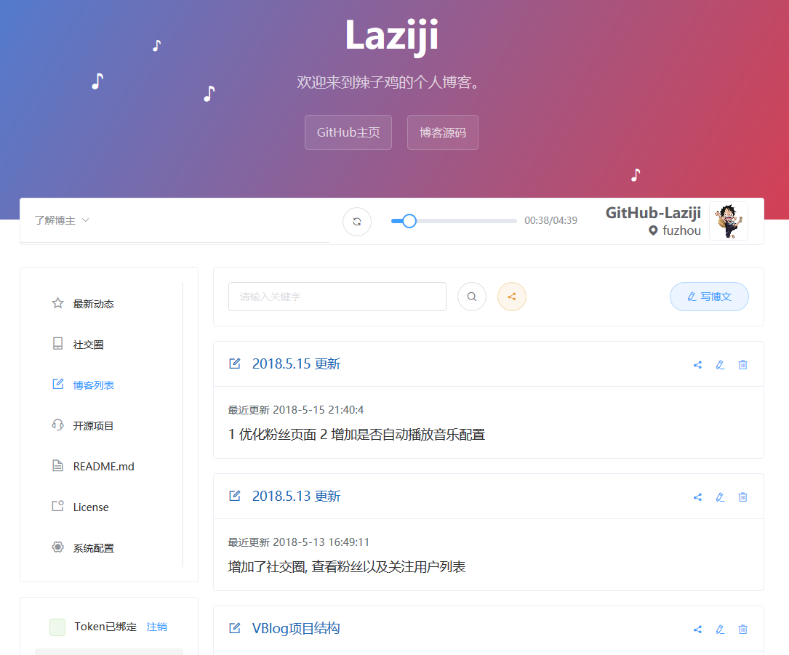
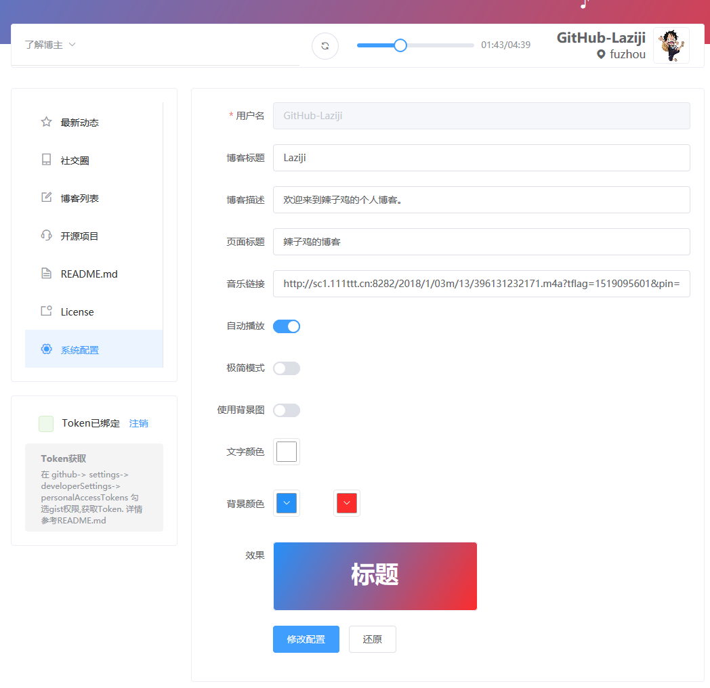
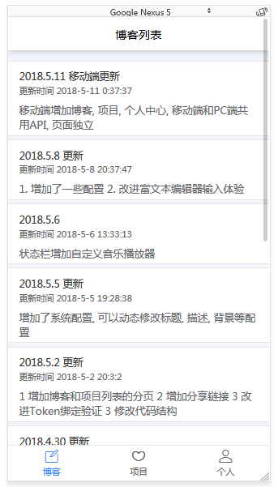
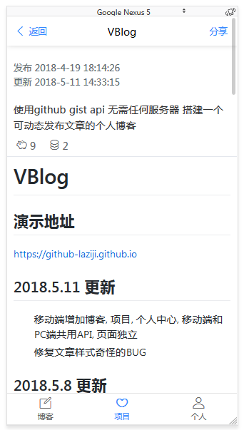

# VBlog


## [English Documents](README-EN.md)

## 目录
- [简介](#简介)
- [演示地址](#演示地址)
- [项目特点](#项目特点)
- [使用的组件](#使用的组件)
- [项目截图](#项目截图)
- [快速使用](#快速使用)
- [开发](#开发)
- [更新记录](#更新记录)
- [License](#License)

## 简介

博客可搭建在 GitHub Pages 上,
文章数据储存于gist 中, 通过Github API 与数据进行交互, 实现无后台、可动态发布文章的博客系统

> 最近暂无更新计划


## 演示地址
[https://github-laziji.github.io][1]

## 项目特点

- [x] 基于 GitHub Pages 无需服务器
- [x] 改进传统 GitHub Pages 不能动态发布的缺陷
- [x] 包含电脑端和移动端
- [x] 单页面应用

## 使用的组件

- Element (电脑端)
- Vant (移动端)

## 项目截图






## 快速使用
搭建博客只需2步
- 点击github头像旁边的 "+" 号 选择 ```Import repository ```克隆地址填 ```https://github.com/GitHub-Laziji/GitHub-Laziji.github.io ```项目名填 ```你的用户名.github.io ```
- 克隆完成后 修改文件 ```/static/configuration.json``` 中的 ```githubUsername``` 为自己的github用户名


类似演示地址其中 GitHub-Laziji 为我的用户名


现在 ```https://你的用户名.github.io``` 就是你的个人博客了,例如[https://github-laziji.github.io][1]

## 开发

#### 安装 运行 构建

    npm install

    npm run dev

    npm run build

#### 获取Token

在 ```github > settings > Developer settings > Personal access tokens```  勾选```gist``` 和 ```repo```权限 获取```Token```

#### 开发注意事项

- 配置文件读取的总是与 ```index.html``` 同级的 ```./static/configuration.json```, 所以本地 ```npm run dev``` 的时候会出现修改配置无效的情况, 如果需要修改的话修改本地的配置文件就行, 发布到 github 之后不影响, 因为修改配置的时候是通过 ```github-api``` 修改 ```你的用户名.github.io``` 下的 ```/static/configuration.json ```

## 更新记录

#### 2018.5.23 更新
- 修改移动端页面样式
- 修改PC端样式小修改
- 去除PC端License

#### 2018.5.23 更新
- 修复404页面显示不正常的bug
- 优化权限不足的情况

#### 2018.5.22 更新
- 增加其他站点的配置, 在状态栏显示个人的其他网站

#### 2018.5.21 更新
- 优化部分提示效果
- 修复博客描述没有换行

#### 2018.5.20 更新
- 修改点击其他博客异常的bug
- 修改日期格式
- 修改使用帮助显示效果

#### 2018.5.19 更新
- 增加使用帮助页面
- 修复没有README.md时候出现的BUG

#### 2018.5.16 更新
- 显示粉丝数量
- 增加粉丝详情页面

#### 2018.5.15 更新
- 粉丝页面优化没有粉丝的情况
- 修改有的图片越界
- 配置增加是否自动播放音乐
- 去除默认音乐

#### 2018.5.13 更新
- 电脑端增加社交圈, 查看粉丝和关注的用户

#### 2018.5.11 更新
- 移动端增加博客, 项目, 个人中心, 移动端和PC端共用API, 页面独立 
- 修复文章样式奇怪的BUG

#### 2018.5.8 更新
- 增加配置选项
- 改善富文本编辑器

#### 2018.5.6 更新
- 状态栏增加音乐播放器

#### 2018.5.5 更新
- 增加了系统配置, 可以动态修改标题, 描述, 背景等配置 

#### 2018.5.2 更新
- 增加博客和项目列表的分页 
- 增加分享链接 
- 改进Token绑定验证 
- 修改代码结构 

#### 2018.4.30 更新
- 添加了从github获取个人开源项目的功能,显示信息更加全面,显示开源项目列表
- Readme 从github动态获取

#### 2018.4.29 更新
- 增加个人信息的状态栏
- 修复发图片博文的BUG 

## License

Code licensed under the [Mozilla](LICENSE).

------


作者 *Laziji*


  [1]: https://github-laziji.github.io
  [2]: https://github.com/GitHub-Laziji/GitHub-Laziji.github.io
