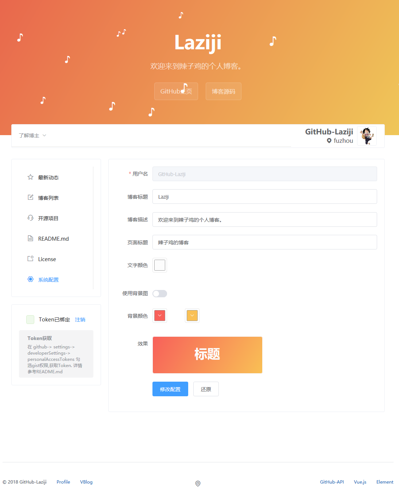
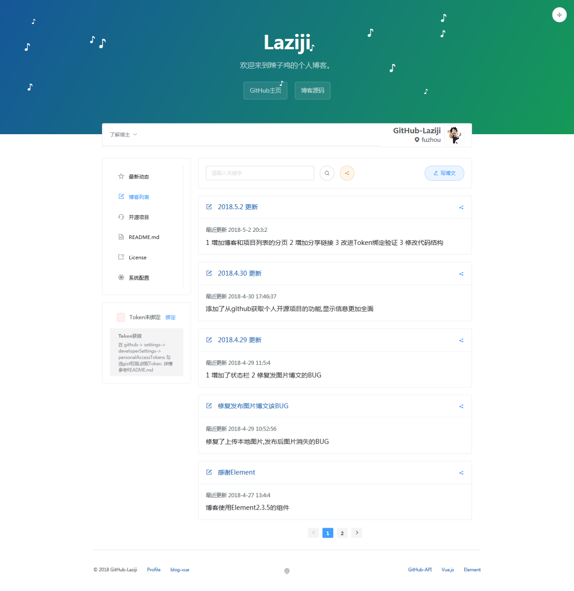

# VBlog

## 2018.5.11 更新
- 移动端增加博客, 项目, 个人中心, 移动端和PC端共用API, 页面独立 

## 2018.5.8 更新
- 增加配置选项
- 改善富文本编辑器

## 2018.5.6 更新
- 状态栏增加音乐播放器

## 2018.5.5 更新
- 增加了系统配置, 可以动态修改标题, 描述, 背景等配置 

## 2018.5.2 更新
- 增加博客和项目列表的分页 
- 增加分享链接 
- 改进Token绑定验证 
- 修改代码结构 

## 2018.4.30 更新
- 添加了从github获取个人开源项目的功能,显示信息更加全面,显示开源项目列表
- Readme 从github动态获取

## 2018.4.29 更新
- 增加个人信息的状态栏
- 修复发图片博文的BUG 

## 简介

博客基于 GitHub Pages 与 Github API 实现无后台，可动态发布博客的系统
博客数据储存于gist 通过Github API 进行增删改查
喜欢的话留下你的星星╭(●｀∀´●)╯╰(●’◡’●)╮

### 特点

- [x] 基于 GitHub Pages 无需服务器
- [x] 改进传统 GitHub Pages 不能动态发布的缺陷
- [x] 使用vue单页面

### 演示地址
[https://github-laziji.github.io][1]

### 快速使用
搭建博客只需2步
1. 点击github头像旁边的 "+" 号 选择 "Import repository" 克隆地址填"https://github.com/GitHub-Laziji/GitHub-Laziji.github.io" 项目名填 "${你的用户名}.github.io" 
2. 克隆完成后 修改文件 /static/configuration.json 中的 "github-username" 为自己的github用户名

类似演示地址其中 GitHub-Laziji 为我的用户名

现在 ${你的用户名}.github.io 就是你的个人博客了,例如[https://github-laziji.github.io][1]

## 准备工作

### 安装

    npm install 

### 运行

    npm run dev 

### 构建

    npm run build

### 获取Token

在 *github > settings > Developer settings > Personal access tokens*  勾选gist repo权限 获取Token

## License

Code licensed under the [Mozilla](LICENSE).

------

作者 *Laziji*

  [1]: https://github-laziji.github.io
  [2]: https://github.com/GitHub-Laziji/GitHub-Laziji.github.io
